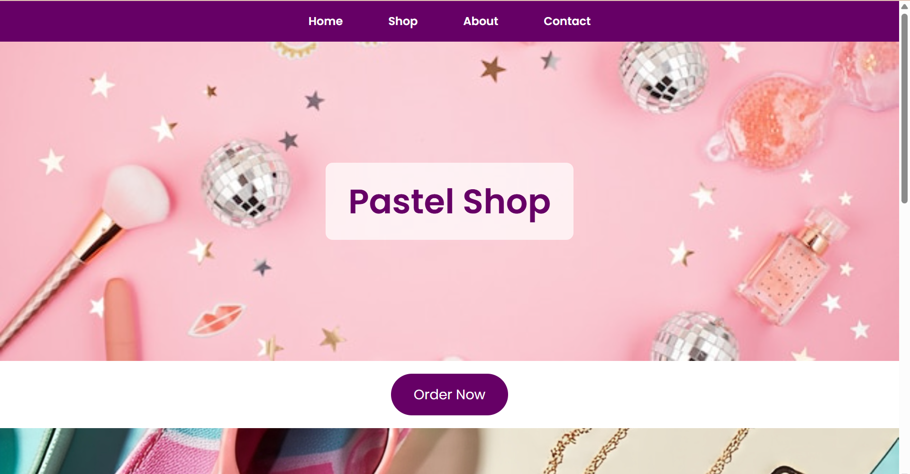
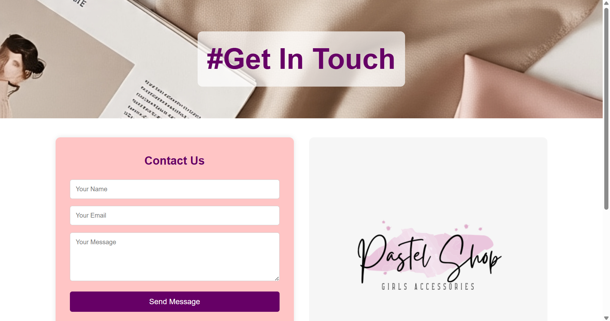
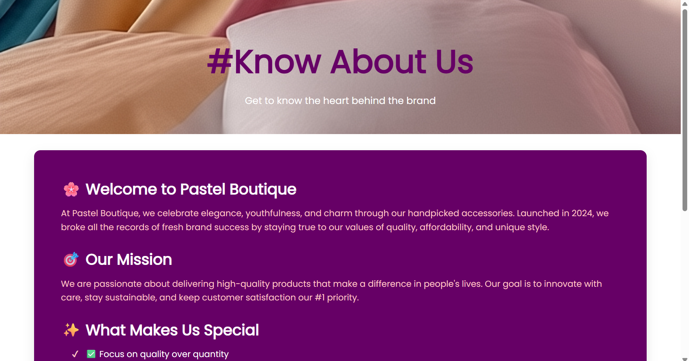

# Pastel-Shop-Website-
A clean and responsive frontend e-commerce site for girls' accessories, built with HTML, CSS, and JavaScript. Features include:  🛍️ Product catalog with add-to-cart  📦 Cart page using localStorage  🎨 Soft pastel-themed UI  📱 Mobile-friendly layout  📧 Contact page included

## 🚀 Features :

🛒 Product Catalog – Browse a collection of accessories

➕ Add to Cart – Store cart items using localStorage

📦 Cart Page – View and manage selected products

🎨 Pastel-Themed UI – Soft, minimal, and elegant design

📱 Responsive Layout – Works seamlessly on desktop & mobile

📧 Contact Page – Simple form for customer inquiries

## 📸 Preview  

 🏠 Home Page  
  

 🛍️ Shop Page
  

📞 Contact Page 
  

ℹ️ About Page
  

## 🔗 Live Demo  

Check out the live version of the project here:  
👉 [E-commerce Website]()

## 🛠️ Tech Stack :

HTML5 – Page structure

CSS3 – Styling and responsive design

JavaScript (ES6) – Interactive features and cart functionality

Bootstrap - For modern features

## 📜 License:

This project is licensed under the MIT License – free to use, modify, and share.